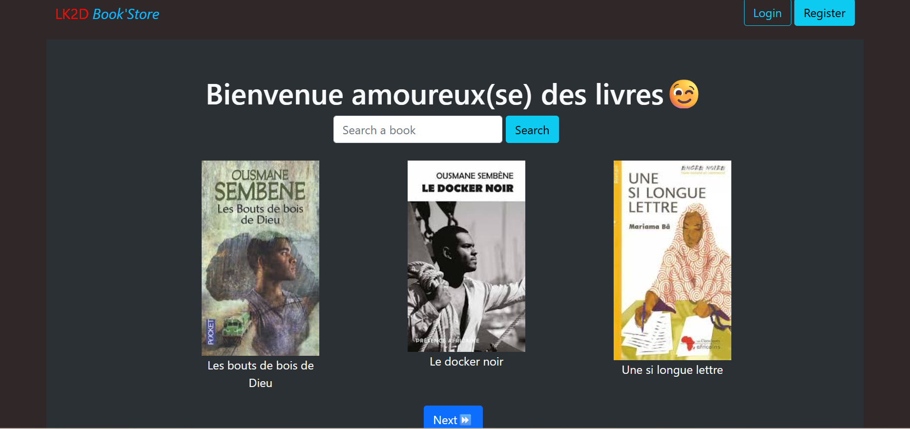
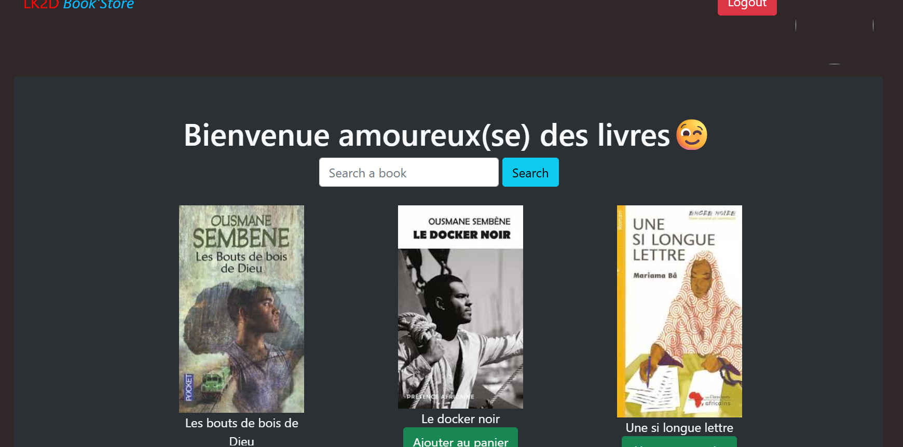
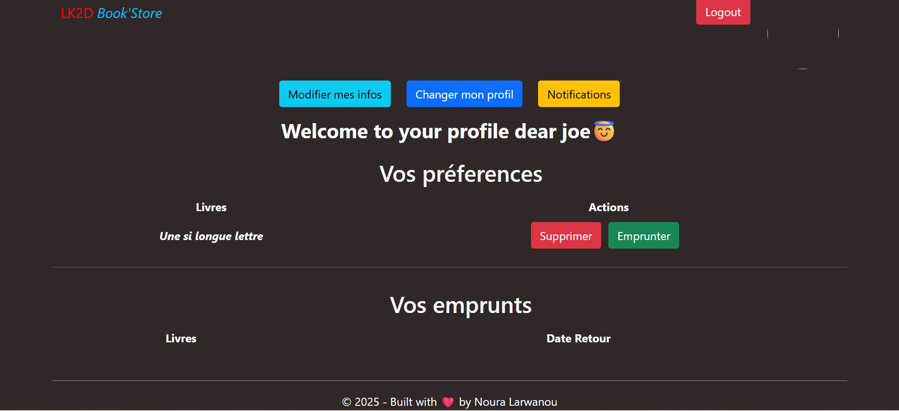

# 📚 LK2D BookStore — Full Stack Django / React

Une application web complète de gestion de bibliothèque permettant aux utilisateurs de **parcourir, rechercher et emprunter des livres** via une interface moderne, avec une API REST sécurisée.

---

## 🚀 Démo & Aperçu

### 🏠 Catalogue (visiteur)



### 👤 Utilisateur connecté



### 📖 Détail d’un livre


### 🛒 Profil (panier & emprunts)



---

## ✨ Fonctionnalités principales

### 🔓 Accès public

* Parcours du catalogue avec pagination
* Recherche de livres par titre
* Consultation des détails (description, disponibilité)

### 🔐 Utilisateur authentifié

* Inscription / connexion (JWT)
* Ajout de livres au panier
* Emprunt de livres
* Gestion du profil utilisateur
* Suivi des emprunts en cours
* Notifications

### ⚙️ Administration (Django Admin)

* Gestion complète du catalogue
* Gestion des utilisateurs
* Suivi des emprunts

---

## 🧠 Architecture & Points techniques

* API REST construite avec **Django REST Framework**
* Authentification sécurisée via **JWT**
* Frontend moderne avec **React + Vite**
* Communication via API REST (architecture client-serveur)
* Organisation modulaire du backend (apps Django)
* Tests des endpoints avec **Insomnia**

---

## 🛠️ Stack Technique

| Domaine          | Technologies                  |
| ---------------- | ----------------------------- |
| Backend          | Django, Django REST Framework |
| Frontend         | React, Vite                   |
| Base de données  | SQLite                        |
| Authentification | JWT                           |
| Outils           | Git, GitHub, Insomnia         |

---

## ⚡ Installation rapide

### 1. Cloner le projet

```bash
git clone https://github.com/nouralarwane/lk2d-bookstore.git
cd lk2d-bookstore
```

---

### 2. Backend (Django)

```bash
cd backend

python -m venv .venv
source .venv/bin/activate        # Linux / macOS
.venv\Scripts\activate           # Windows

pip install -r requirements.txt

cp .env.example .env
# Ajouter SECRET_KEY

python manage.py migrate
python manage.py runserver
```

👉 Backend : http://127.0.0.1:8000

---

### 3. Frontend (React)

```bash
cd frontend_library

npm install

cp .env.example .env
# Vérifier VITE_BACKEND_BASE_API

npm run dev
```

👉 Frontend : http://localhost:5173

---

## 📂 Structure du projet

```
lk2d-bookstore/
├── backend/              # API Django REST
├── frontend_library/     # Application React
├── screenshots/
└── README.md
```

---

## 🔐 Variables d’environnement

```env
# Backend
SECRET_KEY=your-secret-key

# Frontend
VITE_BACKEND_BASE_API=http://127.0.0.1:8000/api
```

---

## 🎯 Objectif du projet

Ce projet démontre ma capacité à :

* concevoir une **application full stack complète**
* développer une **API REST sécurisée**
* intégrer un **frontend React avec un backend Django**
* structurer un projet réel de manière professionnelle

---

## 👤 Auteur

**Larwanou Laouali Noura**
Développeur Full Stack Django / React

* 📧 [nouralarwanou@ump.ac.ma](mailto:nouralarwanou@ump.ac.ma)
* 🔗 LinkedIn : https://www.linkedin.com/in/larwanou-laouali-noura-0147952a6/
* 💻 GitHub : https://github.com/nouralarwane

---

